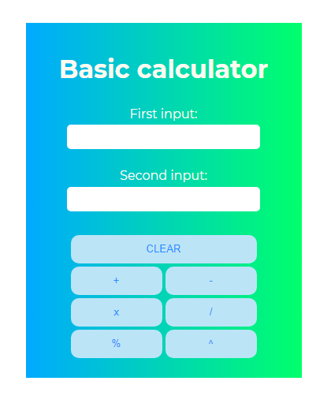

## Calculadora

> *Homework proposto nas aulas de FrontEnd da [Heroway] desenvolvido com JavaScript, HTML5 e CSS3*

## Objetivo:
 - Praticar JavaScript.
 - Realizar operações matemáticas. 
 - Não permitir divisão por zero.

## Desenvolvido com:

* [Visual Studio Code](https://code.visualstudio.com/) - Editor de código fonte

[Heroway]: <https://www.heroway.com.br/treinamento/>
